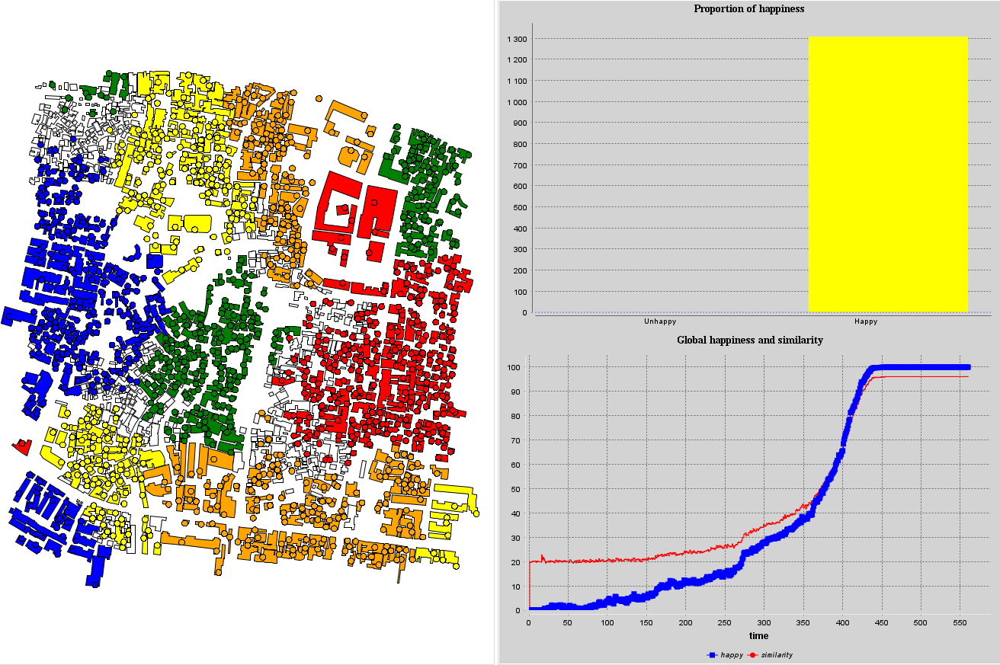

# TP 2 de Systèmes multi-agents sur GAMA

## Choix du modèle

Pour ce travail pratique sur GAMA je vais travailler sur le modèle *Segregation*

## Présentation du modèle
### But du modèle 
Le modèle a pour but de simuler le comportement communautaire des êtres humains, à savoir le fait qu'un humain a une préférence (variable) à être proche de ceux de son groupe et loin des autres.

### Environnement 


L'environnement est une carte qui représente un quartier d'une ville vue du dessus. Le quartier est composé de bâtiments de tailles variables. Au niveau du code il correspond à une liste de `species` appelées `space`. Un `space` correspond à un endroit habitable par un ou plusieurs agents ( `people`) selon son attribut de capacité (`capacity`) . 
#### Variables globales
* Liste de places libres pour les `people`
* Liste de toutes les places
* Le nombre de groupe
* La densité d'individus
* Le pourcentage désiré de similarité souhaité `percent_similar_wanted`
* La distance de perception, la distance maximale à laquelle un `people` va percevoir les autres et définir s'il est satisfait ou non (`is_happy`).
### Agents

Les agents sont ici les `people` ils se présentent sous la forme de cercles de couleurs.
 les `people` possèdent comme attributs:
* Une liste de `people` qui correspond à ses voisins.
* Un habitat `current_building` de type `space` dans lequel il se trouve.
* Un état de joie `is_happy` de type booléen, il est calculé en fonction du voisinage (`total_nearby`) et  (`percent_similar_wanted`).

Les `people` peuvent:
* Changer de localisation avec `move_to_new_place`
* Avoir un `reflex`  `migrate` quand il ne sont pas satisfait de leur localisation actuelle , dans ce cas ils feront appel à `move_to_new_place`.

### Déroulement du modèle
* Initialisation des `spaces`.
* Initialisation des `people`.
* Demande des `people` à bouger, il changeront de place par réflexe.

## Expérimentation, variation des différents paramètres
### Avec 2 communautés
Dans les études avec deux communautés on se concentrera sur l'influence de `percent_similar_wanted` sur la répartition des groupes dans la carte:
| `percent_similar_wanted` | observations | |
|--|--|--|
| 0.05 | On remarque que l'intégralité de la population est très rapidement joyeuse et la répartition des groupes est diversifiée|  |
|0.5|On remarque que l'intégralité de la population est moins rapidement joyeuse et des régions de la carte sont uniformément composée que d'un seul groupe| |
|0.9| La quasi intégralité de la population n'est pas satisfaite, et la répartition des groupes est sans cesse diversifiée  | |
### Avec 5 communautés
Dans le cas d'une analyse avec 5 groupes existants et `percent_similar_wanted` mis à 50% nous avons une satisfaction totale qui croît plus lentement. Cela peut s'expliquer par le fait qu'un individu a plus de chance d'être entouré d'autres d'un groupe différent, donc à chaque itération il sera plus probable qu'une part des individus soient encore insatisfaits. En terme de répartition les 5 groupes se concentrent dans des régions bien délimitées.


## Idées à ajouter au modèle

* Faire en sorte que chaque individu ait un `percent_similar_wanted`personnel, en y initialisant à chaque individu (`people`) un taux compris entre $0$ et $1$ comme on pourrait faire ici:
```c
species base {
	rgb color;
	//List of all the neighbours agents
	list<base> my_neighbours;
	// FEATURE: self similarity preference
	float similiraty_preference <- rnd(1.0);
	//computation of the similar neighbours
	int similar_nearby -> 
		(my_neighbours count (each.color = color))
	;
	//Computation of the total neighbours nearby
	int total_nearby -> 
		length (my_neighbours)
	;
	//Boolean to know if the agent is happy or not
	bool is_happy -> similar_nearby >= (similiraty_preference * total_nearby ) ;
}
```
* Pouvoir créer une stratégie de au sein de chaque communauté pour s'organiser sur les place à prendre ( implémentation ambitieuse)
* Faire en sorte qu'un individu fasse une analyse sur la globalité de la carte pour trouver le meilleur endroit qui le satisfasse en fonction de son `percent_similar_wanted`.
